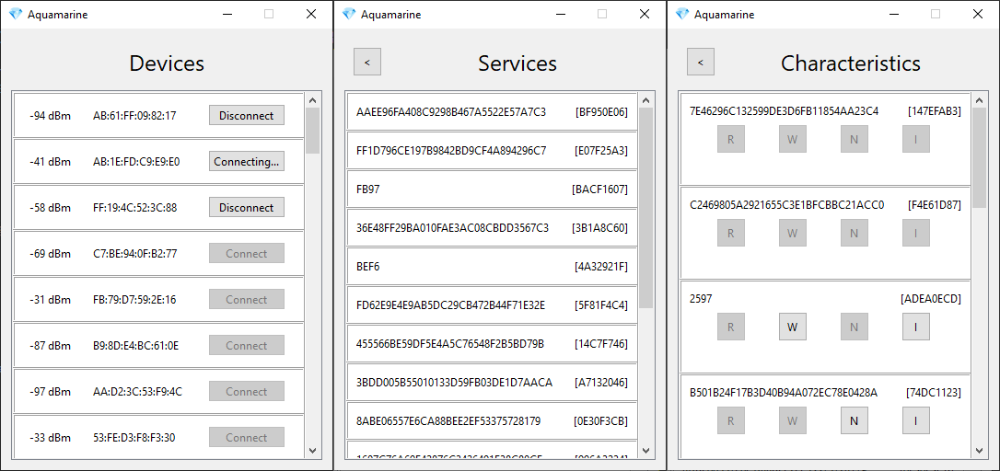

#  Aquamarine

A Python GUI application to view and monitor Bluetooth devices through the use of SiliconLabs's [pybgapi](https://github.com/SiliconLabs/pybgapi).

## Getting Started!

1. `pip install -r requirements.txt`
2. Flash **Bluetooth - NCP** to the [BGM220 Explorer Kit](https://www.silabs.com/development-tools/wireless/bluetooth/bgm220-explorer-kit) (w/ SDK 2024.6.1)
3. `python ./src/main.py`

## Thanks

- Google's [Noto Emoji](https://github.com/googlefonts/noto-emoji) for the application's icon.
- SiliconLabs for the BGM220 module, NCP firmware and pybgapi library.
